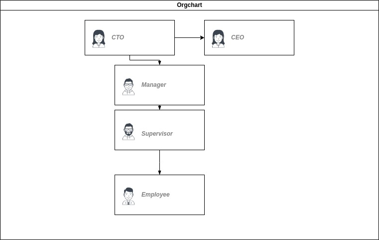
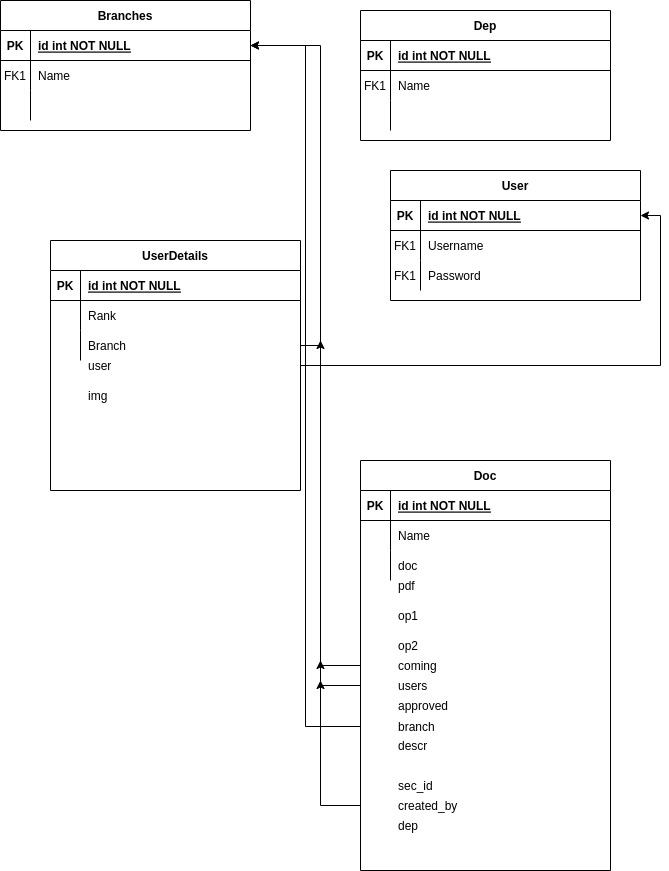

# Heirarchial Correspendece and signature stystem
 This a system where employees can send correspendeces to emplyee directly above them and can return the correspence to employees directly beneath them. The correspendence stays in the system until it finally reaches the CEO or CTO who can approve it and it will automatically add their signature to the document and be sent to the archive
 
 Here is a breakdown of the ranks in the system
 

## Authentication
I used Token authentication to Verify users and pull up their rank

## Database
Here is an ERD of the data base

## Project setup

Install required packages:

    pip3 install -r requirements.txt

Initialize database:

    python3 manage.py makemigrations
    python3 manage.py migrate
  
  ## Documentation
